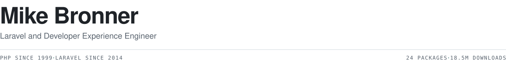

<picture>
  <source media="(prefers-color-scheme: dark)" srcset="assets/header-dark.svg">
  
</picture>

 
 

PHP since 1999. That is long enough to watch the same problems reappear under new names every few years: the frameworks change and the tooling changes, but the friction underneath stays roughly where it was. Most of the work below is aimed at that layer.

The best work in this line is invisible. It removes some friction and then stops asking for attention, which also makes it hard to point at, because when it works there is nothing left to look at.

What that has produced so far is [Laravel packages](#what-ended-up-in-your-composerjson), linting standards, editor tooling, and the process around all three. Most of it began as something worth fixing permanently rather than working around.

 

## What I have come to learn

**Mental debt is the real cost of code.** It is the mental effort required to read something and work out what it does. Naming, structure, and comment decisions are mostly decisions about reducing it, because every reader after the first pays that cost again from scratch.

**Opinions only matter once they become practices.** The clean code standards behind [phpcs-rules](https://github.com/mike-bronner/phpcs-rules) are written as a progression: from a single thought on a line up through statements, concepts, methods, classes, and domains, each level composed from the one below it. Most of the sniffs in the package exist to enforce one level or another of that progression, which is why it is a package rather than a style guide. [The standards in full](https://mikebronner.dev/clean-code)

**A standard nobody enforces is not a standard.** If a rule depends on a person remembering it during review, it holds for about a month. Put it into tooling, or accept that what exists is a preference rather than a standard.

**Be honest about what automation cannot check.** Tools that claim more certainty than they have get disabled, and once disabled they stay disabled. A smaller set of rules a team actually trusts is worth more than a larger set it has learned to ignore.

**Build so the next person can extend without asking.** Architecture is judged by what it costs somebody else to add to it. If a contributor has to modify the core to add a feature, the design has failed regardless of how clean it looks from the inside.

**Do not discard what you do not understand.** Code that survives every cleanup is usually load-bearing for reasons nobody wrote down. Replace it against a parity bar rather than rewriting it from the description, because the description is what somebody remembers rather than what the code does.

**Process is engineering, not ceremony.** A practice adopted to solve an observed problem gets shaped by that problem. A practice adopted because it is standard gets performed.

 

## What I did about it

**Tiered linting, because a tool that cries wolf gets muted.** A rule fires on something that is actually fine, the developer adds an ignore comment, then another, and eventually somebody disables the ruleset for the whole directory. So every rule in [phpcs-rules](https://github.com/mike-bronner/phpcs-rules) is tiered: either machine-enforceable, meaning a sniff can verify it from the token stream with confidence, or documented as review-enforced because static analysis genuinely cannot see what the rule is about. Ninety rules a team trusts beat a hundred and forty it has learned to ignore.

**Editor tooling, because small daily costs are the expensive ones.** An editor that does not know your framework cannot help you with it, and every lost autocompletion costs a few seconds, which is small enough to stop noticing. The Laravel tooling did not exist for Zed yet, which was reason enough to build LSPs for [Laravel](https://github.com/mike-bronner/zed-laravel), [PHPCS](https://github.com/mike-bronner/zed-phpcs-lsp), and [PHPMD](https://github.com/mike-bronner/zed-phpmd-lsp). Worth being clear, since the repositories do not make it obvious: I do not write Rust. I directed and reviewed those implementations rather than typing them, which is a real skill but not the same one.

**Scrum, and then Scrum for agents.** Scrum arrived in 2021 on a team that had grown past the point where informal coordination worked and needed practices it could sustain without heroics. [Five certifications](https://www.credly.com/users/mike-bronner) have followed since, roughly one a year, most recently on product ownership and on using AI within it. What actually matters is which ceremonies change a decision: refinement that produces acceptance criteria specific enough to argue with, prioritization rather than picking, and a review that is allowed to say no.

That transferred to working with AI more directly than expected. Give a capable model a vague task and it will produce something plausible, at length, quickly, and without a definition of done there is no way to say whether it succeeded. So the agents in [claude-workbench](https://github.com/mike-bronner/claude-workbench) run the same process a team would: work is refined before it starts, items are prioritized rather than picked, dependencies keep blocked work out of the queue, and a separate reviewer checks the result against the criteria it was given and can send it back. None of it is novel. It is Scrum, applied to workers that happen not to be people, and it works for the same reasons.

 

## What ended up in your composer.json

First, thank you. There are around 17.9 million downloads across the twenty-two packages I maintain, and that number still surprises me every time I look at it. If something of mine is running in your application, I appreciate you trusting it with your production traffic, and I do not take that lightly.

Each of them exists because a specific problem was worth solving once rather than in every project:

| Package | The problem it solves |
|---|---|
| [**laravel-pivot-events**](https://github.com/mikebronner/laravel-pivot-events) | Eloquent fires events for everything except pivot changes, so cache invalidation and audit logging silently do not run. |
| [**laravel-model-caching**](https://github.com/mike-bronner/laravel-model-caching) | The same query runs on every request, and the N+1 the ORM made easy to write stays invisible until one client has real data volume. |
| [**laravel-caffeine**](https://github.com/mikebronner/laravel-caffeine) | The user spent twenty minutes filling in your form, then the session expired and took the work with it. |
| [**laravel-socialiter**](https://github.com/mikebronner/laravel-socialiter) | Every project reimplements Socialite user persistence slightly differently, which means everybody has slightly different security bugs in it. |
| [**laravel-impersonator**](https://github.com/mikebronner/laravel-impersonator) | Support cannot reproduce what the customer is seeing, so the thread becomes a slow exchange of screenshots. |
| [**laravel-changelog**](https://github.com/mikebronner/laravel-changelog) | Nobody can tell customers what changed without asking an engineer first. |

[All twenty-two, with documentation](https://mikebronner.dev/packages), published continuously since 2014, at roughly 512,000 downloads a month.

 

**If something is broken**, please open an issue on the relevant repository. It helps enormously if you can include your PHP and Laravel versions, the package version, and the smallest reproduction you can manage: more often than not, the reproduction turns out to be most of the fix. I read every issue that comes in. I cannot always fix things quickly, because I maintain these in my own time alongside a full-time job, but I would much rather know about a problem than have you quietly work around it.

**If you are not certain whether it is a bug**, please ask anyway. A question that turns out to be a documentation gap is still useful to me, and it is almost always useful to the next person who has the same question.

**If you would rather reach me directly**, mike.bronner@icloud.com works for anything that does not belong in a public tracker: security concerns, commercial questions, or simply telling me what you built. I answer my email.

**One thing that trips people up:** several packages moved from the `genealabs/` namespace to `mike-bronner/`, and Packagist marks the originals as abandoned. Those originals point at their replacements, and the replacements are actively maintained. If you landed on an abandoned notice, follow the link rather than assuming the project died.

Shipping a package takes a weekend. Keeping one working across twelve years of framework churn is the part that actually costs something, and it is the only part that earns anyone's trust.

 
 

[mikebronner.dev](https://mikebronner.dev) &nbsp;·&nbsp; mike.bronner@icloud.com
